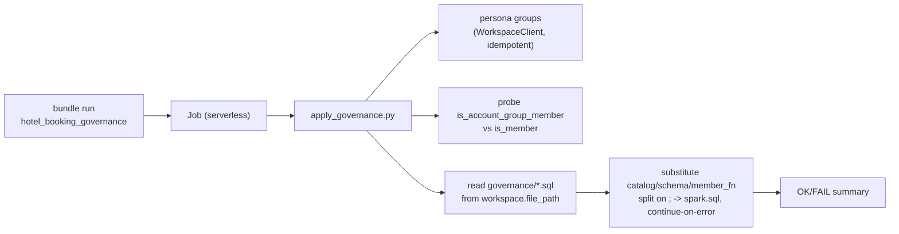

# Governance as a re-runnable DAB job — design

Date: 2026-09-01
Status: implemented

## Goal

Package the Unity Catalog governance layer built in
[2026-09-01-unity-catalog-governance-design.md](2026-09-01-unity-catalog-governance-design.md)
as a standalone, re-runnable job inside the existing `hotel_booking_ingest` Databricks
Asset Bundle, so re-applying governance is one command:

```bash
databricks bundle run hotel_booking_governance -t dev
```

The existing `governance/*.sql` files stay the single source of truth. No new SQL is
introduced; the job is a second runner for the same DDL.

## Approach

A single **serverless notebook task**. The governance flow includes work a plain SQL
warehouse task cannot do (SCIM group creation + membership, choosing `is_member` vs
`is_account_group_member`, per-statement continue-on-error). A Python notebook reproduces
`governance/apply.sh` end to end and runs SQL via `spark.sql`, so no SQL warehouse is
required.



## Components

### Notebook: `src/hotel_booking_ingest/governance/apply_governance.py`

Databricks notebook source (`# Databricks notebook source` header). Steps:

1. Reads widgets `catalog`, `schema`, `governance_path`.
2. Creates the four persona groups (`hotel_engineer`, `hotel_analyst`, `hotel_mgr_city`,
   `hotel_mgr_resort`) via `databricks.sdk.WorkspaceClient` (idempotent — skip if present),
   then adds the run-as user to `hotel_engineer` with a raw SCIM PATCH (mirrors `apply.sh`,
   robust across SDK versions).
3. Probes `is_account_group_member('hotel_engineer')`; if it does not resolve to `true`,
   falls back to `is_member` (workspace groups).
4. Reads `functions.sql`, `comments.sql`, `tags.sql`, `policies.sql`, `grants.sql` from
   `governance_path`, strips `--` comment lines, substitutes `{catalog}` / `{schema}` /
   `{member_fn}`, splits on `;`, and runs each statement via `spark.sql` with
   continue-on-error and a final `OK/FAIL` summary. `constraints.sql` is reference-only and
   is not in the list. Raises only if *every* statement failed (bad catalog/schema or
   missing tables).

### Resource: `resources/hotel_booking_governance.job.yml`

Serverless job with one `notebook_task`. `base_parameters` wire `catalog: ${var.catalog}`,
`schema: ${var.schema}`, and `governance_path: ${workspace.file_path}/governance`. The
bundle's default sync ships `governance/*.sql` to `${workspace.file_path}/governance`, which
the notebook reads with `open()` (Workspace Files are readable on serverless).

## Orchestration

Standalone / on-demand. The job is independent of the ingest pipeline — run it whenever
governance needs to be re-applied (after a pipeline change, a full refresh, or persona
tweaks). It does not chain to `hotel_booking_ingest_etl`.

## Environment limitations (carried over)

- UC object GRANTs require account-level group principals. In a workspace-groups-only
  environment `grants.sql` statements FAIL with `PRINCIPAL_DOES_NOT_EXIST` (expected); the
  mask + row-filter enforcement (keyed to the same groups via `is_member`) still applies.
- `constraints.sql` is reference-only: SDP streaming tables / materialized views reject
  external constraint DDL.

## Verification

- `databricks bundle validate -t dev`
- `databricks bundle deploy -t dev`
- `databricks bundle run hotel_booking_governance -t dev`
- Confirm the run's `OK/FAIL` summary matches `apply.sh` (grants FAIL, everything else OK).
  Evidence captured in [../evidence/governance-dab-job-run.md](../evidence/governance-dab-job-run.md).
