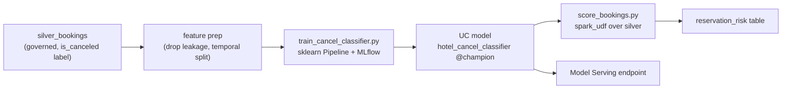

# Cancellation-probability ML slice — design

Date: 2026-09-02
Status: approved

## Goal

Add the "Make it intelligent" stage of the end-to-end project: a supervised classifier
that predicts the probability a hotel booking will cancel, trained on the governed
`silver_bookings` table. Scope is **classic ML only** — no GenAI action layer. The slice
tracks training in MLflow, registers the model to Unity Catalog, batch-scores every
reservation into a `reservation_risk` table (the source the later Lakebase + app stages
consume), and deploys a real-time Model Serving endpoint for on-demand scoring.

## Architecture

## Components (`src/hotel_booking_ml/`)

### `train_cancel_classifier.py` (Databricks notebook, committed with outputs)

- Reads `${catalog}.${schema}.silver_bookings` (Spark -> pandas). Job runs as the engineer
  identity, so masks / row filters do not restrict training data.
- Feature set (intersected with the live schema at runtime for robustness):
  - **Categoricals (one-hot):** `hotel`, `meal`, `market_segment`, `distribution_channel`,
    `reserved_room_type`, `deposit_type`, `customer_type`.
  - **Numerics (passthrough):** `lead_time`, `arrival_year`, `arrival_date_week_number`,
    `stays_in_weekend_nights`, `stays_in_week_nights`, `adults`, `children`, `babies`,
    `is_repeated_guest`, `previous_cancellations`, `previous_bookings_not_canceled`,
    `booking_changes`, `days_in_waiting_list`, `adr`, `required_car_parking_spaces`,
    `total_of_special_requests`, `stay_nights`.
- Estimator: sklearn `Pipeline(ColumnTransformer(OneHotEncoder + numeric passthrough),
  HistGradientBoostingClassifier)`. HistGB needs no extra serving dependency; LightGBM is a
  drop-in alternative if we want a marginal lift later.
- **Temporal split** on `arrival_date`: train on the earliest ~80% of arrivals, test on the
  latest ~20% (cutoff = 80th percentile of `arrival_date`). Honest evaluation that matches
  how the model is used — scoring future arrivals.
- `mlflow.sklearn.autolog()` plus manual metrics logged and printed inline: ROC-AUC,
  PR-AUC, precision / recall / F1, confusion matrix, permutation feature importance
  (matplotlib plots logged as artifacts).
- Registers the fitted pipeline to UC `${catalog}.${schema}.hotel_cancel_classifier` and
  sets the alias `@champion`, with an input signature + example.

### `score_bookings.py` (Databricks notebook)

- Loads `models:/${catalog}.${schema}.hotel_cancel_classifier@champion` via
  `mlflow.pyfunc.spark_udf` and scores all of `silver_bookings` distributed.
- Writes `${catalog}.${schema}.reservation_risk`:
  `reservation_id`, `hotel`, `cancel_probability` (double), `risk_band` (string),
  `model_version` (int), `scored_at` (timestamp). Overwrite each run.
- `risk_band`: `high` if p >= 0.7, `medium` if p >= 0.4, else `low` (documented, adjustable).

## Bundle resources (`resources/`)

- `hotel_booking_ml.job.yml`: two standalone serverless notebook jobs — `hotel_cancel_train`
  and `hotel_cancel_score` — each passing `catalog: ${var.catalog}` and
  `schema: ${var.schema}` as `base_parameters` (mirrors the governance job).
- `hotel_cancel_serving.yml`: a `model_serving_endpoints` resource named
  `hotel-cancel-classifier` serving `hotel_cancel_classifier@champion`, scale-to-zero.

## Target-leakage guardrails (excluded from features)

- `reservation_status`, `reservation_status_date` — post-outcome fields that literally state
  "Canceled" / "Check-Out" / "No-Show".
- `est_lost_revenue` — derived from `is_canceled` in silver.
- `assigned_room_type` — room assignment happens at/near check-in; treated as potential
  leakage and dropped (keep `reserved_room_type`).
- `reservation_id` (surrogate key), `agent` / `company` (PII-masked high-cardinality
  identifiers), `country` (178-value high cardinality — dropped to avoid one-hot explosion),
  and the ingest metadata columns (`_rescued_data`, `_ingested_at`, `_source_file`).

## Environment / limitations

- Assumes serverless job compute includes scikit-learn + mlflow (standard on Databricks
  serverless). No extra libraries required.
- Assumes Model Serving is enabled in the workspace. Fallback: keep the batch
  `reservation_risk` table (the downstream source of truth) and skip the endpoint if serving
  is unavailable.
- `reservation_risk` is not governed in this slice; folding it into the governance layer is
  a later step.

## Verification (dev)

- `databricks bundle validate/deploy -t dev`.
- Run `hotel_cancel_train`: confirm an MLflow run with ROC-AUC in the expected ~0.85-0.90
  range and a registered `@champion` version.
- Run `hotel_cancel_score`: `reservation_risk` row count matches `silver_bookings`,
  `cancel_probability` in [0, 1], sane `risk_band` distribution.
- Query the serving endpoint with a sample payload and capture the response.
- Evidence in `docs/evidence/ml-cancel-classifier-run.md`.

## Out of scope

GenAI recommended-action layer, Lakebase sync, the Databricks app, and governing the
`reservation_risk` table (later slices).
