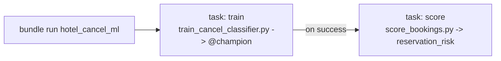

# Consolidate ML into one chained DAB job — design

Date: 2026-09-02
Status: approved

## Goal

Package the ML components as a single re-runnable job so the full cancellation-model refresh
runs from one command, mirroring how the governance layer became a single re-runnable job.
Previously the slice shipped two standalone jobs (`hotel_cancel_train`, `hotel_cancel_score`)
that had to be run in sequence by hand.

## Approach

Replace the two jobs in `resources/hotel_booking_ml.job.yml` with one multi-task job
`hotel_cancel_ml`:

- Two serverless notebook tasks sharing one `environment`; each passes `catalog` / `schema`
  as `base_parameters`.
- `score` declares `depends_on: [train]`, so it runs only after `train` succeeds
  (default `all_success`). One `databricks bundle run hotel_cancel_ml -t dev` retrains,
  re-registers `hotel_cancel_classifier@champion`, then refreshes `reservation_risk`.
- On-demand only (no schedule), matching the governance job.

## Unchanged

- The notebooks `train_cancel_classifier.py` and `score_bookings.py` — only their
  orchestration changes.
- The serving endpoint `resources/hotel_cancel_serving.yml` stays a separate bundle resource
  deployed with the resolved `@champion` version (`--var cancel_model_version`). Promotion is
  intentionally not folded into the job.

## Ripple

- Deleting `hotel_cancel_train` / `hotel_cancel_score` is intended: `bundle deploy` destroys
  those two jobs and creates `hotel_cancel_ml`. No data/model impact — the model and tables
  are Unity Catalog objects, not job-owned.
- README run block collapses two `bundle run` lines into one; evidence doc job references
  updated.
- Also clears the earlier "define a single job per .job.yml file" validation recommendation.

## Verification (dev)

- `databricks bundle validate -t dev` and `deploy -t dev`.
- `databricks bundle run hotel_cancel_ml -t dev`: both tasks SUCCEED in order and
  `reservation_risk` row count matches `silver_bookings`.
