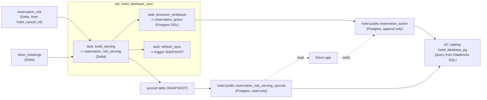

# Lakebase serving + write-back slice — design

Date: 2026-09-29
Status: approved

## Goal

Stand up a Lakebase (managed Postgres) layer that serves per-reservation cancellation risk to
the future operational app at low latency, and gives the app a place to record actions
(re-confirmations, deposit requests, overbooking backups, notes). Everything is declared in
the DAB bundle so the layer re-creates on `bundle deploy` / `bundle run`, consistent with the
ingest, governance, and ML slices already in the repo.

Read side and write side are deliberately separated:

- **Read** — a Databricks-managed **synced table** (reverse ETL, SNAPSHOT) mirrors a
  denormalized Delta serving table into Postgres. Read-only, refreshed per batch scoring run.
- **Write** — a **native Postgres table** (`reservation_action`, append-only) the app inserts
  into. Not synced from Delta; it is Lakebase's own OLTP data.

## Decisions (from brainstorming)

| Question | Decision |
|----------|----------|
| Lakebase role | Read-serving **+** operational write-back |
| Read content | One denormalized "at-risk reservation" table (risk + key booking detail) |
| Sync mechanism | Databricks-managed synced table, **SNAPSHOT** (full refresh per run) |
| Provisioning | All in the DAB bundle (Approach A: one job, three tasks) |
| Write-back model | Append-only `reservation_action` event log |
| Tier | DABs-native **GA Database Instance** (`CU_1`); the CLI-only Autoscaling `postgres` project is not bundle-supported |

## Architecture

Two resource files declare three resources plus one job. The split lets us hold the synced
table + catalog out during phase 1 of the deploy (see Deploy strategy):

- `resources/hotel_lakebase.yml` — the **Database Instance** and the **`hotel_lakebase_sync`
  job**.
- `resources/hotel_lakebase_synced.yml` — the **Synced Table** and the **Database Catalog**
  (moved aside during phase 1, added back in phase 3).

The declarative resources are created by `bundle deploy`; the job performs the imperative data
movement + DDL.

### Bundle resources

In `resources/hotel_lakebase.yml`:

- **`database_instances.hotel_lakebase`** — `name: hotel-lakebase` (dev-prefixed in
  development mode), `capacity: CU_1`, `stopped: false`. Smallest instance; can be set
  `stopped: true` when idle to save cost.

In `resources/hotel_lakebase_synced.yml` (held out during phase 1):

- **`synced_database_tables.reservation_risk_serving_synced`** —
  - `name: ${var.catalog}.${var.schema}.reservation_risk_serving_synced` (UC table name)
  - `database_instance_name: hotel-lakebase`
  - `logical_database_name: hotel`
  - `spec.source_table_full_name: ${var.catalog}.${var.schema}.reservation_risk_serving`
  - `spec.primary_key_columns: [reservation_id]`
  - `spec.scheduling_policy: SNAPSHOT`
  - `spec.create_database_objects_if_missing: true`
  - `spec.new_pipeline_spec.storage_catalog: ${var.catalog}` /
    `storage_schema: ${var.schema}`
- **`database_catalogs.hotel_lakebase_pg`** — `name: hotel_lakebase_pg`,
  `database_instance_name: hotel-lakebase`, `database_name: hotel`,
  `create_database_if_not_exists: true`. Registers the Postgres logical DB `hotel` as a UC
  catalog so both Postgres tables are queryable from Databricks SQL for verification.

## Data model

- **Delta serving source** `${catalog}.${schema}.reservation_risk_serving` (built by the job):
  `reservation_id` (PK), `hotel`, `arrival_date`, `lead_time`, `adr`, `market_segment`,
  `adults`, `children`, `babies`, `deposit_type`, `customer_type`, `cancel_probability`,
  `risk_band`, `model_version`, `scored_at`. This is `reservation_risk` joined to selected
  `silver_bookings` columns.
- **Synced read replica** (Postgres) `hotel.public.reservation_risk_serving_synced` — SNAPSHOT
  copy of the above, keyed on `reservation_id`. Read-only.
- **Native write-back** (Postgres) `hotel.public.reservation_action` — append-only:
  - `id BIGSERIAL PRIMARY KEY`
  - `reservation_id TEXT NOT NULL`
  - `action_type TEXT NOT NULL` — one of `reconfirmed | deposit_requested |
    overbooked_backup | released | note`
  - `note TEXT`
  - `acted_by TEXT`
  - `acted_at TIMESTAMPTZ NOT NULL DEFAULT now()`

  App inserts one row per action; latest-per-reservation is a simple
  `DISTINCT ON (reservation_id) ... ORDER BY acted_at DESC` query.

## The `hotel_lakebase_sync` job (Approach A)

One serverless multi-task job, on-demand only (no schedule), matching the governance/ML jobs.

1. **`build_serving`** — notebook `src/hotel_booking_lakebase/build_serving_table.py`.
   Joins `reservation_risk` + `silver_bookings`, writes `reservation_risk_serving` Delta
   (`overwrite`, `overwriteSchema`). `dbutils.notebook.exit(json {rows})`.
2. **`provision_writeback`** (`depends_on: [build_serving]`) — notebook
   `src/hotel_booking_lakebase/provision_writeback.py`. Uses the Databricks SDK
   (`WorkspaceClient`) to fetch the instance host and generate a database OAuth credential,
   connects via `psycopg2`, runs idempotent `CREATE DATABASE hotel` (if missing) +
   `CREATE TABLE IF NOT EXISTS reservation_action (...)`. This task is the **authoritative
   creator of the `hotel` logical database**; the synced table and catalog resources
   (`create_*_if_missing`) then find it already present.
   `dbutils.notebook.exit(json {writeback_ready: true})`.
3. **`refresh_sync`** (`depends_on: [build_serving]`) — notebook
   `src/hotel_booking_lakebase/refresh_sync.py`. Resolves the synced table's underlying
   pipeline id and triggers an update for a fresh SNAPSHOT, then polls to completion.
   **On the first run (phase 2), the synced table is not deployed yet**, so the task logs
   "synced table not found — skipping" and exits gracefully; once the synced table exists
   (phase 3+), it refreshes normally. `dbutils.notebook.exit(json {sync_state})`.

Auth note: notebooks connect to Postgres with an OAuth token generated at run time (1-hour
expiry), regenerated per task; user is the run-as identity's `userName`.

## Deploy strategy — two-phase (chicken-and-egg)

The synced table reads its source table's schema **at creation**, so
`reservation_risk_serving` must exist first. This mirrors the two-phase serving-endpoint
deploy already used for the ML slice:

1. Deploy instance + job, with the synced table + catalog held out
   (`resources/hotel_lakebase_synced.yml` moved aside, as we did for the serving yml).
2. Run the full `hotel_lakebase_sync` job: `build_serving` creates the
   `reservation_risk_serving` Delta table, `provision_writeback` creates the `hotel` database +
   `reservation_action` table, and `refresh_sync` no-ops (synced table not deployed yet).
3. Move `hotel_lakebase_synced.yml` back and deploy — the synced table + catalog are created
   and the SNAPSHOT auto-populates from the now-existing Delta source.
4. Run the full `hotel_lakebase_sync` job again (now `refresh_sync` refreshes the SNAPSHOT) and
   verify.

Subsequent refreshes are a single `bundle run hotel_lakebase_sync` (build → snapshot refresh);
no more phasing needed once the source table and synced table exist.

## Dependencies / ripple

- Depends on `reservation_risk` (produced by `hotel_cancel_ml`) and `silver_bookings`
  (produced by the ingest pipeline) — both already deployed on `fevm-fe-bar-ecastillo`.
- Adds `resources/hotel_lakebase.yml` (+ a temporarily-held `hotel_lakebase_synced.yml`
  during phase 1) and `src/hotel_booking_lakebase/*.py`. No changes to existing slices.
- README gets a Lakebase run block; a new evidence doc records the run.
- `psycopg2-binary` needed in the serverless job environment for the write-back/refresh tasks.

## Error handling & cost

- Idempotent DDL (`CREATE TABLE IF NOT EXISTS`, `CREATE DATABASE` guarded); serving Delta
  written with `overwrite`.
- OAuth tokens regenerated per task (1-hour expiry).
- `refresh_sync` polls the pipeline and fails loudly on a non-success terminal state.
- DABs orders instance → synced table/catalog via `database_instance_name` references.
- `CU_1` is the smallest instance; set `stopped: true` when idle (documented in evidence).

## Verification (dev)

- `databricks bundle validate -t dev` and `deploy -t dev` (two-phase per above).
- Instance state `ACTIVE`; synced table `ONLINE`; UC catalog `hotel_lakebase_pg` visible.
- `reservation_risk_serving` row count matches `reservation_risk` (~119,389); Postgres synced
  replica row count matches.
- `reservation_action` table exists; insert a sample row via `psql` and read it back
  (simulates an app write-back).
- Query both Postgres tables from Databricks SQL through the `hotel_lakebase_pg` catalog.
